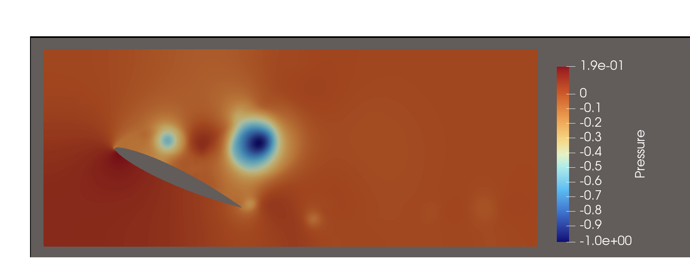
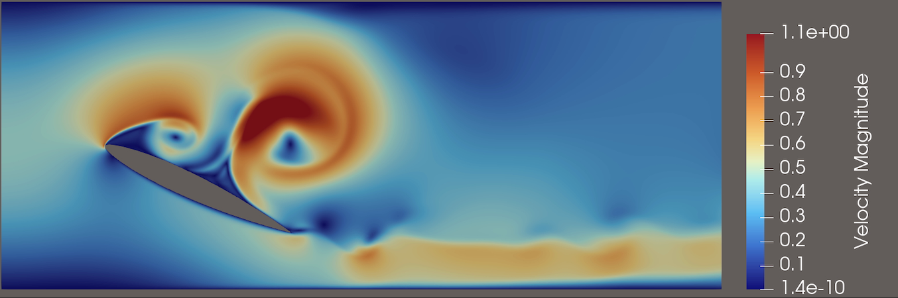

# AFC Using DRL on NACA Airfoils

An open-source implementation and extension of **Li et al. (2025)** — *"Time-resolved deep reinforcement learning for control of the flow past an airfoil"* ([Physics of Fluids, 37, 017118](https://doi.org/10.1063/5.0245111)).

This project trains a **Recurrent PPO** agent to perform active flow control (AFC) over NACA airfoils by actuating surface jets to maximize the lift-to-drag ratio $C_L/C_D$ ($\beta$) . The CFD solver is built on **DOLFINx** (IPCS method, Taylor-Hood P2/P1 elements).

> **Note:** This is not original research. It is a faithful implementation and extension of the above paper, open-sourced to lower the barrier for others replicating physics-based DRL experiments. 

The primary extension is an optional CNN feature extractor inserted before the LSTM layers. In the original paper, the raw probe observations (velocity and pressure) sampled on a structured grid are flattened into a 1D vector before being fed to the LSTM. Flattening discards the spatial structure of the grid: two probes that are neighbours in 2D become arbitrary entries in a sequence, and the network must learn proximity implicitly from weights alone.

Replacing the flatten with a small CNN allows the network to first learn spatially-aware features from the probe grid which captures local flow patterns such as recirculation zones and shear layers, before the LSTM integrates those features over time. A richer, spatially-coherent input representation should lead to faster convergence or a higher peak $\beta$. 

Also note, that I currently do not have access to a supercomputer to run the full testing, so the extension is mostly a hypothesis (a damn good one though!). Also, I encourage to run full training on HPC clusters as compute power is a strong bottleneck for this project. Regardless, the original 9s of uncontrolled flow are shared in this repo, you can see the vortices below at 9 seconds, or open paraview and have a look through the whole flow yourself. 





---

## Extensions Beyond the Paper

- Support for **arbitrary NACA profiles** (via `.dat` files)
- Configurable **jet chord-wise positions**
- Selectable **probe density**: `fine` (16×12 = 192 sensors) or `coarse` (8×6 = 48 sensors)
- Optional **CNN feature extractor** in place of the paper's plain LSTM observation pipeline
- Pre-computed **CFD checkpoints** included — skip the ~9s uncontrolled warm-up on first run
- **SLURM batch script** for HPC deployment (tested on ASU SOL)

---

## Repository Structure

```
AFC_DRL/
├── airfoils/               ← Airfoil geometry .dat files
├── assets/images/          ← README figures 
├── checkpoints/
│   └── naca0012_alpha25/   ← Pre-computed uncontrolled CFD state (saves ~9s CFD)
├── notebooks/
│   └── main.ipynb          ← Interactive pipeline (mesh → CFD → train → infer)
├── results/
│   ├── training/           ← Saved policy .zip files
│   └── inference/          ← C_D / C_L arrays from inference runs
├── scripts/
│   ├── train_headless.py   ← CLI training script (for HPC/SLURM)
│   └── sol_train.sh        ← SLURM job script, (built for ASU SOL, but can be modified) 
├── src/
│   ├── configuration/      ← AirfoilConfig: geometry, mesh, jet/probe setup
│   ├── cfd/                ← CFDParameters: DOLFINx IPCS solver
│   ├── env/                ← Gymnasium environment + CFD stepping interface
│   └── rl/                 ← RecurrentPPO agent + optional CNN extractor
├── environment.yml         ← Conda environment
└── LICENSE
```

---

## Setup

Requires **conda** or **mamba**. DOLFINx must be installed via `conda-forge`.

```bash
git clone https://github.com/YOUR_USERNAME/AFC-DRL-NACA-Airfoils.git
cd AFC-DRL-NACA-Airfoils

mamba env create -f environment.yml
conda activate afc-drl
```

---

## Usage

### Interactive (Jupyter)
```bash
cd notebooks
jupyter lab
# Open main.ipynb and run cells top to bottom
```

The notebook walks through:
1. **Airfoil & mesh generation** — Gmsh mesh for any NACA profile at a given AoA
2. **Uncontrolled CFD** — IPCS solver runs 9 s of flow; checkpoint saved *(skippable — pre-computed checkpoint included)*
3. **RL training** — RecurrentPPO trains for N episodes; TensorBoard logging
4. **Inference** — Load saved policy, run one deterministic episode, compare $C_L/C_D$

### Headless / HPC
```bash
# Single node
python scripts/train_headless.py --n_episodes 500

# MPI (DOLFINx parallel assembly)
mpirun -n 8 python scripts/train_headless.py --n_episodes 500

# SLURM (ASU SOL)
sbatch scripts/sol_train.sh
```

### TensorBoard
```bash
tensorboard --logdir results/tensorboard
```

---

## Physical Setup

| Parameter | Value |
|---|---|
| Airfoil | NACA 0012 |
| Angle of attack | 25° |
| Reynolds number | 2,500 |
| Peak inlet velocity $U_m$ | 0.45 m/s |
| CFD time step $\Delta t$ | 1/1600 s |
| Episode length | 576 RL steps × 25 CFD steps = 9 s |
| Jets | 3 upper-surface jets at $x/c$ = 0.2, 0.4, 0.6 |
| Observation | $(u_x, u_y, p)$ at 192 probe points (16×12 grid) |
| Reward | $r_t = \langle C_L/C_D \rangle_T - r_0$ |

---

## References

```bibtex
@article{10.1063/5.0245111,
    author = {Li, Kaiyu (励凯宇) and Liang, Zhiquan (梁志铨) and Fan, Hao (樊昊) and Liang, Wenkai (梁文恺)},
    title = {Time-resolved deep reinforcement learning for control of the flow past an airfoil},
    journal = {Physics of Fluids},
    volume = {37},
    number = {1},
    pages = {017118},
    year = {2025},
    month = {01},
    abstract = {},
    issn = {1070-6631},
    doi = {10.1063/5.0245111},
    url = {https://doi.org/10.1063/5.0245111},
    eprint = {https://pubs.aip.org/aip/pof/article-pdf/doi/10.1063/5.0245111/20336120/017118_1_5.0245111.pdf},
}
```

CFD implementation guided by:  
Dokken, J. S. (2026). *FEniCSx Tutorial — Flow past a cylinder.* https://jsdokken.com/dolfinx-tutorial

Special thanks to Surya Kamalabhavam (skamalab@asu.edu) for contributing deeply to the CFD section of this project. 

---

## License

MIT — see [LICENSE](LICENSE).
